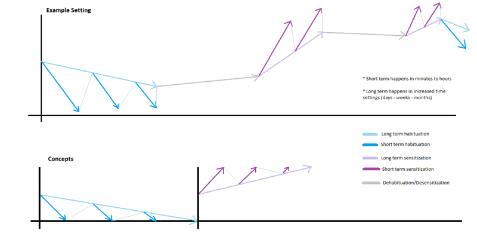
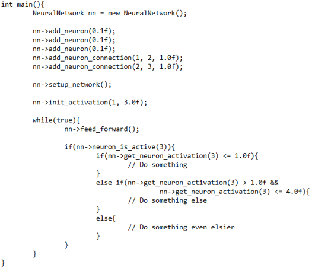
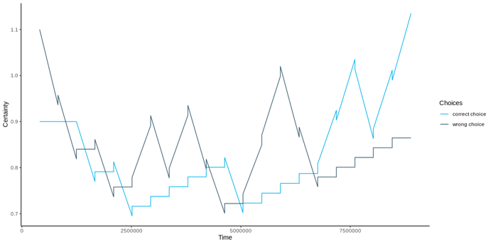
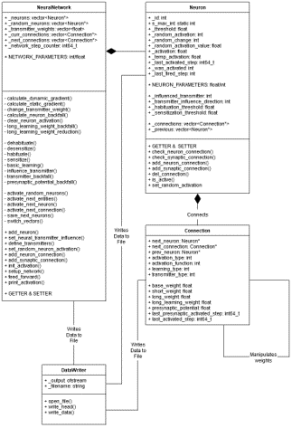

# COGNA

## Currently not further developed, because of switch to the official Nengo neuro engineering framework.

<h1>Idea</h1>
  The idea behind COGNA (Cognitive Oriented Generalized Neural Approach) is to simulate basic neurochemical principles from various neurological studies and combine them in one network architecture. Main research goal was to simulate the behavior of the gill reflex of the Aplysia Californica when stimulated as in the experiments conducted by Eric Kandel et al. in the 1960s - 1970s. The main modeled behavior is sensitization, habituation and basic classical conditioning. Additionally some other conceps, such as neurotransmitters also have been implemented.
  
<h1>Concept</h1>
  Generally a COGNA network contains multiple neuron objects which are connected with dedicated connection objects. Each neuron can have multiple connections to different neurons, but only one connection to a single other neuron. Neurons can also have connections to other connections to modulate their activation and learning behavior.
  
  The present neural network allows for realistic simulation of biological neural systems. It uses a collection of digital neurons which communicate with each other with an analogous code. The idea is derived from spiking neural networks, which means, that time plays a role in this network type. When an input is processed, it does not reach the output instantaneously, rather than one array of connections after another. This approach allows for runtime manipulation of connections and activations based on updated information and memory.
  
The network has unique features which are listed below:

    • Excitatory & inhibitory connections:
    The present network allows for excitatory and inhibitory connections.
    This means, that firing neurons not always activate receiving neurons, but (if predefined) they can also reduce activation from receiving neurons.
    This can be used for processing contrasts, which is an important ability for real life decision making.
    
    • Biologically inspired learning:
    In its current state, connections and weights in the present network cannot be adjusted using backpropagation or other commonly used learning algorithms.
    It rather uses biologically inspired methods to dynamically adjust its connectivity to its current environment.
    Two learning methods have currently been selected: habituation and sensitization. Habituation is a mechanism where neural connections weaken, when activated weakly multiple times.
    Sensitization is the opposite where connections strenghten after strong activations.
    They allow for simple learning behavior.
    However, it is hypothesized, that with those two learning methods more complex methods, such as operant conditioning, can be constructed in multineural approaches.
    The correct combination of sensitization and habituation allowed for
    
    • Presynaptic connections:
    A connection coming from a neuron can connect to another connection. This allows for biasing the connection.
    It does not change the threshold of a neuron, but it can increase or decrease the activation coming from this neuron when it fires.
    This allows for implementation of biological learning mechanisms, such as classical conditioning.
    
    • Neurotransmitters:
    Every connection works with a neurotransmitter. Every connection can have a different neurotransmitter.
    The amount of specific transmitters can be increased or decreased during runtime when certain neurons fire.
    This simulates biological neurotransmitters and hormone systems and can influence the general connectivity of the network based on various situational cues.
  
<h1>Architecture</h1>
  Contrary to most other network architectures not all connections are activated simultaneously, rather than one step after another. This allows for including time as a variable in the processing of information. When a neuron is activated, it activates all following neurons, those activate all next neurons and so on.
  This happens by storing pointers to all connections, which must be activated currently inside a global array. All connections which are inside of this array fire by clearing the array saving all next connections inside of it, if the activation threshold of a neuron is exceeded.

<h1>Running Tests</h1>

    • First compile the project with the makefile. For this just type "make" in the when you are in the root folder of the project. The executable test files are now in the build/tests folder.

    • You can run "aplysia_test" or "simple_reinforcement_learning_test" to test out the basic functionalities of COGNA. Those files can be used standalone.

    • Running "builder_test" offers the whole functionality of COGNA, where you can run custom networks defined with the COGNA editor (which is in another repository). You must pass an existing project name in the "Projects" folder in the root folder as a program argument. If the project exists, it is automatically built and run. You can define custom networks with the COGNA editor and place them in the "Project" folder to run your own networks.
    
    • For a first test of the "builder_test", you can run "./builder_test Interface_Test", which will run a very simple network showcasing the UDP interface functions of COGNA. While the network is running start the "udp_listener.py" script in the "test_scripts" folder in the root folder. This starts a receiver listening to one defined port (40002) of the Interface_Test network. The script "udp_pulse.py" will emit one single packet on one port (40001) on channel 1. This will induce a short activation pulse if executed correctly. All networking here happens on the localhost. For both scripts you need a installed Python 3 version.

<h1>Images</h1>
Basic Learning Concepts Sensitization/Habituation

Example to create a COGNA network with code

Learning data for very simple reinforcement learning problem with two alternatives

Basic UML diagram of COGNA system

